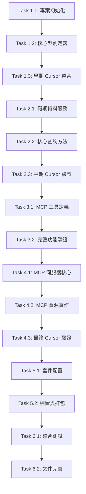

# 台灣假期 MCP 伺服器 - 開發計劃

## 專案概述

基於 PRD 和技術規格，採用 Small Batch 開發方式，以最小可測試單元為基礎，確保每個開發階段都有可交付的成果。整體開發時間控制在 1 天內。

## 任務相依性圖表

## 開發階段規劃

### 階段 1：專案基礎建設 + 早期 Cursor 整合 (3.5 小時)

#### Task 1.1: 專案初始化

- [ ] **T1.1.1** 建立專案目錄結構
  - [ ] **T1.1.1.1** 創建 `src/` 目錄
  - [ ] **T1.1.1.2** 創建 `dist/` 目錄
  - [ ] **T1.1.1.3** 創建 `tests/` 目錄
  - [ ] **T1.1.1.4** 創建 `tests/unit/` 目錄
  - [ ] **T1.1.1.5** 創建 `tests/integration/` 目錄
  - [ ] **T1.1.1.6** 創建 `tests/fixtures/` 目錄（測試資料）
  - [ ] **T1.1.1.7** 設定 `.gitignore`
- [ ] **T1.1.2** 設定 TypeScript 環境
  - [ ] **T1.1.2.1** 創建 `tsconfig.json`
  - [ ] **T1.1.2.2** 創建 `tsconfig.test.json`（測試專用）
  - [ ] **T1.1.2.3** 設定編譯選項 (ES2022, Node.js 18+)
- [ ] **T1.1.3** 安裝核心依賴
  - [ ] **T1.1.3.1** `@modelcontextprotocol/sdk ^1.0.1`
  - [ ] **T1.1.3.2** `@types/node ^22`
  - [ ] **T1.1.3.3** `typescript ^5.6.2`
- [ ] **T1.1.4** 安裝測試依賴
  - [ ] **T1.1.4.1** `jest ^29.7.0`
  - [ ] **T1.1.4.2** `@types/jest ^29.5.0`
  - [ ] **T1.1.4.3** `ts-jest ^29.1.0`
  - [ ] **T1.1.4.4** `supertest ^6.3.0`（API 測試）
  - [ ] **T1.1.4.5** `nock ^13.4.0`（HTTP 模擬）

**測試驗證：** [階段 1 驗證標準](./verification/stage-1-verification.md#task-11-專案初始化---測試驗證)

#### Task 1.2: 核心型別定義與測試設定

- [ ] **T1.2.1** 定義假期資料型別 (`src/types.ts`)
  - [ ] **T1.2.1.1** `Holiday` 介面 (與 TaiwanCalendar 格式一致)
  - [ ] **T1.2.1.2** `HolidayStats` 介面
  - [ ] **T1.2.1.3** 日期格式驗證型別
- [ ] **T1.2.2** 定義 MCP 相關型別
  - [ ] **T1.2.2.1** 工具回傳格式型別
  - [ ] **T1.2.2.2** 錯誤處理型別
- [ ] **T1.2.3** 設定測試環境
  - [ ] **T1.2.3.1** 創建 `jest.config.js`
  - [ ] **T1.2.3.2** 設定測試腳本在 `package.json`
  - [ ] **T1.2.3.3** 創建測試資料檔案 (`tests/fixtures/sample-holidays.json`)
  - [ ] **T1.2.3.4** 建立基本測試工具函數 (`tests/utils/test-helpers.ts`)

**測試驗證：** [階段 1 驗證標準](./verification/stage-1-verification.md#task-12-核心型別定義與測試設定---測試驗證)

#### Task 1.3: 🚀 早期 Cursor 整合驗證點

- [ ] **T1.3.1** 建立基礎 MCP 伺服器 (`src/server.ts`)
  - [ ] **T1.3.1.1** 基本 MCP 伺服器框架
  - [ ] **T1.3.1.2** 單一測試工具 `ping`（後續會擴展為實際工具）
  - [ ] **T1.3.1.3** 基本錯誤處理
- [ ] **T1.3.2** 設定入口點 (`src/index.ts`)
  - [ ] **T1.3.2.1** shebang 設定
  - [ ] **T1.3.2.2** 基本 stdio 處理
  - [ ] **T1.3.2.3** 載入伺服器實例
- [ ] **T1.3.3** 設定 package.json
  - [ ] **T1.3.3.1** bin 欄位指向入口點
  - [ ] **T1.3.3.2** 基本 scripts 設定

**🎯 Cursor 整合測試：** [階段 1 驗證標準](./verification/stage-1-verification.md#task-13-早期-cursor-整合驗證點)

**✅ 早期驗證成功標準：** [階段 1 驗證標準](./verification/stage-1-verification.md#早期驗證成功標準)

### 階段 2：資料服務層實作 + 中期 Cursor 驗證 (5.5 小時)

#### Task 2.1: 假期資料服務與單元測試

- [ ] **T2.1.1** 實作 `HolidayService` 類別 (`src/holiday-service.ts`)
  - [ ] **T2.1.1.1** CDN 資料獲取方法（含重試機制）
  - [ ] **T2.1.1.2** 完整錯誤處理（網路、解析、驗證錯誤）
  - [ ] **T2.1.1.3** 記憶體快取機制（含 TTL）
  - [ ] **T2.1.1.4** 資料驗證（JSON Schema）
- [ ] **T2.1.2** 實作日期解析功能 (`src/utils/date-parser.ts`)
  - [ ] **T2.1.2.1** 支援 `YYYY-MM-DD` 格式
  - [ ] **T2.1.2.2** 支援 `YYYYMMDD` 格式
  - [ ] **T2.1.2.3** 日期驗證邏輯
  - [ ] **T2.1.2.4** 錯誤訊息標準化
- [ ] **T2.1.3** 建立測試資料和模擬
  - [ ] **T2.1.3.1** 創建 `tests/fixtures/taiwan-holidays-2024.json`
  - [ ] **T2.1.3.2** 設定 HTTP 請求模擬（nock）
  - [ ] **T2.1.3.3** 建立錯誤情境測試資料

**測試驗證：** [階段 2 驗證標準](./verification/stage-2-verification.md#task-21-假期資料服務與單元測試---測試驗證)

#### Task 2.2: 核心查詢方法與整合測試

- [ ] **T2.2.1** 實作 `checkHoliday(date: string)` 方法
  - [ ] **T2.2.1.1** 日期格式轉換
  - [ ] **T2.2.1.2** 假期資料查詢
  - [ ] **T2.2.1.3** 結果格式化
  - [ ] **T2.2.1.4** 錯誤處理和驗證
- [ ] **T2.2.2** 實作 `getHolidaysInRange(start, end)` 方法
  - [ ] **T2.2.2.1** 日期範圍驗證
  - [ ] **T2.2.2.2** 跨年度資料處理
  - [ ] **T2.2.2.3** 結果排序
  - [ ] **T2.2.2.4** 效能最佳化
- [ ] **T2.2.3** 實作 `getHolidayStats(year, month?)` 方法
  - [ ] **T2.2.3.1** 統計計算邏輯
  - [ ] **T2.2.3.2** 月份篩選功能
  - [ ] **T2.2.3.3** 記憶體效率最佳化
- [ ] **T2.2.4** 建立整合測試
  - [ ] **T2.2.4.1** 端到端查詢流程測試
  - [ ] **T2.2.4.2** 效能基準測試
  - [ ] **T2.2.4.3** 錯誤恢復測試

**測試驗證：** [階段 2 驗證標準](./verification/stage-2-verification.md#task-22-核心查詢方法與整合測試---測試驗證)

#### Task 2.3: 🚀 中期 Cursor 驗證點

- [ ] **T2.3.1** 擴展 MCP 伺服器 (`src/server.ts`)
  - [ ] **T2.3.1.1** 整合 `HolidayService`
  - [ ] **T2.3.1.2** 將 `ping` 工具替換為 `check_holiday` 工具
  - [ ] **T2.3.1.3** 新增 `get_holidays_range` 工具
  - [ ] **T2.3.1.4** 完善錯誤處理和驗證
- [ ] **T2.3.2** 更新相關依賴
  - [ ] **T2.3.2.1** 確保非同步操作正常
  - [ ] **T2.3.2.2** 改善錯誤訊息格式

**🎯 Cursor 整合測試：** [階段 2 驗證標準](./verification/stage-2-verification.md#task-23-中期-cursor-驗證點)

### 階段 3：MCP 工具實作 (4 小時)

#### Task 3.1: MCP 工具定義與完整測試

- [ ] **T3.1.1** 實作 `check_holiday` 工具 (`src/tools/check-holiday.ts`)
  - [ ] **T3.1.1.1** 輸入參數驗證（JSON Schema）
  - [ ] **T3.1.1.2** 呼叫 HolidayService
  - [ ] **T3.1.1.3** 格式化回傳結果
  - [ ] **T3.1.1.4** 錯誤處理和日誌記錄
- [ ] **T3.1.2** 實作 `get_holidays_in_range` 工具 (`src/tools/get-holidays-in-range.ts`)
  - [ ] **T3.1.2.1** 日期範圍參數驗證
  - [ ] **T3.1.2.2** 結果格式化
  - [ ] **T3.1.2.3** 錯誤處理
  - [ ] **T3.1.2.4** 大量資料處理最佳化
- [ ] **T3.1.3** 實作 `get_holiday_stats` 工具 (`src/tools/get-holiday-stats.ts`)
  - [ ] **T3.1.3.1** 年份/月份參數驗證
  - [ ] **T3.1.3.2** 統計資料格式化
  - [ ] **T3.1.3.3** 記憶體效率最佳化
- [ ] **T3.1.4** 建立 MCP 工具測試套件
  - [ ] **T3.1.4.1** 參數驗證測試
  - [ ] **T3.1.4.2** 回傳格式測試
  - [ ] **T3.1.4.3** 錯誤情境測試
  - [ ] **T3.1.4.4** 效能測試

**測試驗證：** [階段 3 驗證標準](./verification/stage-3-verification.md#task-31-mcp-工具定義與完整測試---測試驗證)

#### Task 3.2: 🚀 完整功能 Cursor 驗證點

- [ ] **T3.2.1** 完善 MCP 伺服器 (`src/server.ts`)
  - [ ] **T3.2.1.1** 新增第三個工具 `get_holiday_stats`
  - [ ] **T3.2.1.2** 完整錯誤處理機制
  - [ ] **T3.2.1.3** 效能最佳化
  - [ ] **T3.2.1.4** 完善日誌記錄
- [ ] **T3.2.2** 最終化建置配置
  - [ ] **T3.2.2.1** 確認 package.json 設定正確
  - [ ] **T3.2.2.2** 完整建置和測試流程

**🎯 Cursor 整合測試：** [階段 3 驗證標準](./verification/stage-3-verification.md#task-32-完整功能驗證)

**✅ 完整功能驗證成功標準：**
- [ ] **T3.2.V1** 所有三個工具都能正常運作
- [ ] **T3.2.V2** 錯誤處理完善，提供有意義的錯誤訊息
- [ ] **T3.2.V3** 效能符合預期（快取機制正常）
- [ ] **T3.2.V4** 沒有記憶體洩漏或協議錯誤
- [ ] **T3.2.V5** 用戶體驗良好，回應格式清晰易讀

### 階段 4：MCP 協議整合 + 最終 Cursor 驗證 (3.5 小時)

#### Task 4.1: MCP 伺服器核心與協議測試

- [ ] **T4.1.1** 實作 `TaiwanHolidayMcpServer` 類別 (`src/server.ts`)
  - [ ] **T4.1.1.1** 伺服器初始化
  - [ ] **T4.1.1.2** 能力宣告設定
  - [ ] **T4.1.1.3** 完整錯誤處理和日誌記錄
  - [ ] **T4.1.1.4** 優雅關閉機制
- [ ] **T4.1.2** 設定工具處理器
  - [ ] **T4.1.2.1** `ListToolsRequestSchema` 處理
  - [ ] **T4.1.2.2** `CallToolRequestSchema` 處理
  - [ ] **T4.1.2.3** 工具路由分發
  - [ ] **T4.1.2.4** 參數驗證中介層
- [ ] **T4.1.3** 建立 MCP 協議測試
  - [ ] **T4.1.3.1** JSON-RPC 2.0 協議測試
  - [ ] **T4.1.3.2** 工具列表查詢測試
  - [ ] **T4.1.3.3** 工具執行測試
  - [ ] **T4.1.3.4** 錯誤回應格式測試

**測試驗證：** [階段 4 驗證標準](./verification/stage-4-verification.md#task-41-mcp-伺服器核心與協議測試---測試驗證)

#### Task 4.2: MCP 資源實作與測試

- [ ] **T4.2.1** 實作資源處理器
  - [ ] **T4.2.1.1** `ListResourcesRequestSchema` 處理
  - [ ] **T4.2.1.2** `ReadResourceRequestSchema` 處理
  - [ ] **T4.2.1.3** 資源 URI 解析和驗證
  - [ ] **T4.2.1.4** 動態資源生成
- [ ] **T4.2.2** 資源內容格式化
  - [ ] **T4.2.2.1** JSON 格式輸出
  - [ ] **T4.2.2.2** MIME 類型設定
  - [ ] **T4.2.2.3** 大型資源的分頁處理
- [ ] **T4.2.3** 建立資源測試套件
  - [ ] **T4.2.3.1** 資源列表測試
  - [ ] **T4.2.3.2** 資源讀取測試
  - [ ] **T4.2.3.3** URI 解析測試
  - [ ] **T4.2.3.4** 錯誤處理測試

**測試驗證：** [階段 4 驗證標準](./verification/stage-4-verification.md#task-42-mcp-資源實作與測試---測試驗證)

#### Task 4.3: 🚀 最終 Cursor 驗證點

- [ ] **T4.3.1** NPX 套件本地測試
  - [ ] **T4.3.1.1** 建立本地 NPM 連結
  - [ ] **T4.3.1.2** 測試 `npx taiwan-holiday-mcp` 安裝
  - [ ] **T4.3.1.3** 驗證 Cursor 可以透過 NPX 載入
- [ ] **T4.3.2** 完整系統整合測試
  - [ ] **T4.3.2.1** 測試所有功能組合
  - [ ] **T4.3.2.2** 壓力測試（併發查詢）
  - [ ] **T4.3.2.3** 長時間穩定性測試

**🎯 Cursor NPX 整合測試：** [階段 4 驗證標準](./verification/stage-4-verification.md#task-43-最終-cursor-驗證點)

### 階段 5：NPX 套件設定 (2 小時)

#### Task 5.1: 套件配置與跨平台測試

- [ ] **T5.1.1** 設定 `package.json`
  - [ ] **T5.1.1.1** bin 欄位設定
  - [ ] **T5.1.1.2** files 欄位設定
  - [ ] **T5.1.1.3** scripts 設定（build, test, start, dev）
  - [ ] **T5.1.1.4** engines 欄位（Node.js 版本限制）
  - [ ] **T5.1.1.5** keywords 和 repository 設定
- [ ] **T5.1.2** 建立入口點 (`src/index.ts`)
  - [ ] **T5.1.2.1** shebang 設定
  - [ ] **T5.1.2.2** 主函數實作
  - [ ] **T5.1.2.3** 完整錯誤處理
  - [ ] **T5.1.2.4** 優雅關閉處理
  - [ ] **T5.1.2.5** 環境變數支援
- [ ] **T5.1.3** 建立跨平台測試
  - [ ] **T5.1.3.1** Windows 相容性測試
  - [ ] **T5.1.3.2** macOS 相容性測試
  - [ ] **T5.1.3.3** Linux 相容性測試
  - [ ] **T5.1.3.4** Node.js 版本相容性測試

**測試驗證：** [階段 5 驗證標準](./verification/stage-5-verification.md#task-51-npx-套件設定與跨平台測試---測試驗證)

#### Task 5.2: 建置與打包完整測試

- [ ] **T5.2.1** 設定建置腳本
  - [ ] **T5.2.1.1** TypeScript 編譯設定
  - [ ] **T5.2.1.2** 輸出目錄清理
  - [ ] **T5.2.1.3** 型別定義檔生成
  - [ ] **T5.2.1.4** Source map 生成
- [ ] **T5.2.2** 測試 NPX 執行
  - [ ] **T5.2.2.1** 本地測試執行
  - [ ] **T5.2.2.2** 參數傳遞測試
  - [ ] **T5.2.2.3** 錯誤情境測試
  - [ ] **T5.2.2.4** 效能測試
- [ ] **T5.2.3** 建立端到端測試
  - [ ] **T5.2.3.1** 完整 MCP 流程測試
  - [ ] **T5.2.3.2** 客戶端整合測試
  - [ ] **T5.2.3.3** 記憶體洩漏測試

**測試驗證：** [階段 5 驗證標準](./verification/stage-5-verification.md#task-52-建置與打包完整測試---測試驗證)

### 階段 6：整合測試與文件 (2 小時)

#### Task 6.1: 完整整合測試與品質保證

- [ ] **T6.1.1** MCP 協議相容性測試
  - [ ] **T6.1.1.1** 工具列表查詢測試
  - [ ] **T6.1.1.2** 工具執行測試
  - [ ] **T6.1.1.3** 資源存取測試
  - [ ] **T6.1.1.4** 錯誤處理測試
  - [ ] **T6.1.1.5** 效能基準測試
- [ ] **T6.1.2** 客戶端相容性測試
  - [ ] **T6.1.2.1** Claude Desktop 設定測試
  - [ ] **T6.1.2.2** Cursor/Windsurf 設定測試
  - [ ] **T6.1.2.3** 實際客戶端連接測試
- [ ] **T6.1.3** 品質保證測試
  - [ ] **T6.1.3.1** 程式碼覆蓋率檢查（目標 >80%）
  - [ ] **T6.1.3.2** 記憶體洩漏測試
  - [ ] **T6.1.3.3** 長時間運行穩定性測試
  - [ ] **T6.1.3.4** 併發請求處理測試

**測試驗證：** [階段 6 驗證標準](./verification/stage-6-verification.md#task-61-完整整合測試與品質保證---測試驗證)

#### Task 6.2: 文件完善與部署準備

- [ ] **T6.2.1** 更新 README.md
  - [ ] **T6.2.1.1** 專案簡介和特色
  - [ ] **T6.2.1.2** 安裝說明（NPX 和本地安裝）
  - [ ] **T6.2.1.3** 使用範例和設定指南
  - [ ] **T6.2.1.4** API 文件連結
  - [ ] **T6.2.1.5** 故障排除指南
- [ ] **T6.2.2** 建立使用範例
  - [ ] **T6.2.2.1** 基本查詢範例
  - [ ] **T6.2.2.2** 進階使用案例
  - [ ] **T6.2.2.3** 客戶端設定範例
- [ ] **T6.2.3** 建立 API 文件
  - [ ] **T6.2.3.1** MCP 工具詳細說明
  - [ ] **T6.2.3.2** 資源格式說明
  - [ ] **T6.2.3.3** 錯誤代碼參考
- [ ] **T6.2.4** 準備發布
  - [ ] **T6.2.4.1** 版本號確認
  - [ ] **T6.2.4.2** 變更日誌建立
  - [ ] **T6.2.4.3** 授權條款確認

**測試驗證：** [階段 6 驗證標準](./verification/stage-6-verification.md#task-62-文件完善與部署準備---測試驗證)

## 時間分配總覽

- **階段 1**：專案基礎建設 + 早期 Cursor 整合 (3.5 小時)
- **階段 2**：資料服務層實作 + 中期 Cursor 驗證 (5.5 小時)
- **階段 3**：MCP 工具實作 (4 小時)
- **階段 4**：MCP 協議整合 + 最終 Cursor 驗證 (3.5 小時)
- **階段 5**：NPX 套件設定 (2 小時)
- **階段 6**：品質保證與文件 (2 小時)

**總計：20 小時（約 2.5 個工作天）**

## 🎯 Cursor 整合驗證策略

本計劃的核心特色是**多階段 Cursor 驗證**，確保每個開發階段都能在實際使用環境中驗證：

### 早期驗證（階段 1）
- 建立基礎 MCP 伺服器框架
- 用 `ping` 工具驗證基本 JSON-RPC 協議通訊
- 確保 Cursor 能成功載入伺服器

### 中期驗證（階段 2）
- 整合實際假期資料服務
- 將 `ping` 替換為實際工具（`check_holiday`、`get_holidays_range`）
- 驗證錯誤處理和效能

### 完整功能驗證（階段 3）
- 新增第三個工具（`get_holiday_stats`）
- 驗證用戶體驗和回應格式
- 確保功能完整性

### 最終驗證（階段 4）
- NPX 套件安裝測試
- 生產環境模擬
- 長時間穩定性驗證

這種**漸進式驗證**方法能夠：
- 🚀 **早期發現問題**：避免後期大量重構
- 🔄 **快速迭代**：每階段都有可用的版本
- ✅ **降低風險**：確保每個功能都經過實際測試
- 📈 **提升品質**：在真實環境中驗證用戶體驗

## 風險控制與品質保證

### 高風險項目與緩解措施

| 風險項目 | 風險等級 | 緩解措施 | 驗證方式 |
|----------|----------|----------|----------|
| TaiwanCalendar 資料來源可用性 | 🔴 高 | 準備備用資料來源、實作重試機制 | 網路錯誤模擬測試 |
| MCP SDK 相容性問題 | 🟡 中 | 版本鎖定、相容性測試 | 多版本 SDK 測試 |
| NPX 執行環境差異 | 🟡 中 | 跨平台測試、環境檢測 | Windows/macOS/Linux 測試 |
| 記憶體洩漏風險 | 🟡 中 | 長時間運行測試、記憶體監控 | 穩定性測試 |
| 併發請求處理 | 🟢 低 | 併發測試、效能基準 | 負載測試 |

### 品質保證標準

#### 測試覆蓋率要求

- [ ] **單元測試覆蓋率 ≥ 85%**
- [ ] **整合測試覆蓋率 ≥ 70%**
- [ ] **端到端測試覆蓋率 ≥ 90%**

#### 效能基準

- [ ] **首次 API 呼叫 < 2 秒**
- [ ] **快取 API 呼叫 < 100ms**
- [ ] **併發 10 個請求 < 5 秒**
- [ ] **記憶體使用 < 100MB**

#### 相容性要求

- [ ] **Node.js 18+ 支援**
- [ ] **Windows 10+ 相容**
- [ ] **macOS 12+ 相容**
- [ ] **Ubuntu 20.04+ 相容**

## 成功標準

### 技術標準 ✅

- [ ] 所有 MCP 工具正常運作
- [ ] NPX 直接執行成功
- [ ] 與 Claude Desktop 成功整合
- [ ] 與 Cursor/Windsurf 成功整合
- [ ] 完整錯誤處理和恢復機制
- [ ] 程式碼覆蓋率達標
- [ ] 效能基準達標

### 功能標準 ✅

- [ ] 準確查詢台灣假期資訊
- [ ] 支援多種日期格式輸入 (`YYYY-MM-DD`, `YYYYMMDD`)
- [ ] 提供完整的假期統計功能
- [ ] 支援日期範圍查詢
- [ ] 提供 MCP 資源存取
- [ ] 快取機制正常運作

### 使用者體驗標準 ✅

- [ ] 清楚的錯誤訊息
- [ ] 完整的文件和範例
- [ ] 簡單的安裝和設定流程
- [ ] 穩定的長時間運行

---

**計劃版本**：v2.0 (完善測試版)  
**建立日期**：2025-06-09  
**預估完成時間**：20 小時 (約 2.5 個工作天)  
**負責人**：開發團隊  
**品質保證**：完整測試策略 + 效能基準 + 跨平台相容性
