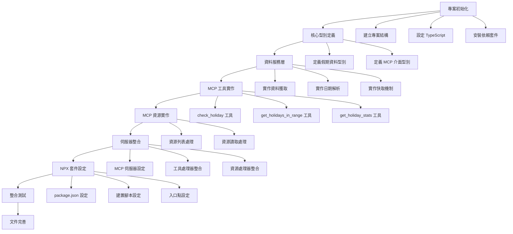

# 台灣假期 MCP 伺服器 - 開發計劃

## 專案概述

基於 PRD 和技術規格，採用 Small Batch 開發方式，以最小可測試單元為基礎，確保每個開發階段都有可交付的成果。整體開發時間控制在 1 天內。

## 任務相依性圖表



## 開發階段規劃

### 階段 1：專案基礎建設 + 早期 Cursor 整合 (3.5 小時)

#### Task 1.1: 專案初始化

- [ ] 建立專案目錄結構
  - [ ] 創建 `src/` 目錄
  - [ ] 創建 `dist/` 目錄
  - [ ] 創建 `tests/` 目錄
  - [ ] 創建 `tests/unit/` 目錄
  - [ ] 創建 `tests/integration/` 目錄
  - [ ] 創建 `tests/fixtures/` 目錄（測試資料）
  - [ ] 設定 `.gitignore`
- [ ] 設定 TypeScript 環境
  - [ ] 創建 `tsconfig.json`
  - [ ] 創建 `tsconfig.test.json`（測試專用）
  - [ ] 設定編譯選項 (ES2022, Node.js 18+)
- [ ] 安裝核心依賴
  - [ ] `@modelcontextprotocol/sdk ^1.0.1`
  - [ ] `@types/node ^22`
  - [ ] `typescript ^5.6.2`
- [ ] 安裝測試依賴
  - [ ] `jest ^29.7.0`
  - [ ] `@types/jest ^29.5.0`
  - [ ] `ts-jest ^29.1.0`
  - [ ] `supertest ^6.3.0`（API 測試）
  - [ ] `nock ^13.4.0`（HTTP 模擬）

**測試驗證：**

```bash
npm run build  # 確認 TypeScript 編譯成功
npm test      # 確認測試框架運作正常
npm run test:coverage  # 確認覆蓋率報告生成
```

#### Task 1.3: 🚀 早期 Cursor 整合驗證點

- [ ] 建立基礎 MCP 伺服器 (`src/server.ts`)
  - [ ] 基本 MCP 伺服器框架
  - [ ] 單一測試工具 `ping`（後續會擴展為實際工具）
  - [ ] 基本錯誤處理
- [ ] 設定入口點 (`src/index.ts`)
  - [ ] shebang 設定
  - [ ] 基本 stdio 處理
  - [ ] 載入伺服器實例
- [ ] 設定 package.json
  - [ ] bin 欄位指向入口點
  - [ ] 基本 scripts 設定

**🎯 Cursor 整合測試：**

```bash
# 建置初始版本
npm run build

# 在 Cursor 中測試
# 1. 修改 .cursor/mcp.json:
{
  "mcp": {
    "servers": {
      "taiwan-holiday": {
        "command": "node",
        "args": ["./dist/index.js"],
        "cwd": "/path/to/your/project"
      }
    }
  }
}

# 2. 重啟 Cursor
# 3. 測試基本連接：在 Cursor 中詢問 "請列出可用的 MCP 工具"
# 4. 測試 ping 工具：在 Cursor 中詢問 "請執行 ping 工具"
```

**✅ 早期驗證成功標準：**
- [ ] Cursor 成功載入 MCP 伺服器
- [ ] 可以列出 `ping` 工具
- [ ] `ping` 工具可以正常執行並回傳 "pong"
- [ ] 沒有 JSON-RPC 協議錯誤

#### Task 1.2: 核心型別定義與測試設定

- [ ] 定義假期資料型別 (`src/types.ts`)
  - [ ] `Holiday` 介面 (與 TaiwanCalendar 格式一致)
  - [ ] `HolidayStats` 介面
  - [ ] 日期格式驗證型別
- [ ] 定義 MCP 相關型別
  - [ ] 工具回傳格式型別
  - [ ] 錯誤處理型別
- [ ] 設定測試環境
  - [ ] 創建 `jest.config.js`
  - [ ] 設定測試腳本在 `package.json`
  - [ ] 創建測試資料檔案 (`tests/fixtures/sample-holidays.json`)
  - [ ] 建立基本測試工具函數 (`tests/utils/test-helpers.ts`)

**測試驗證：**

```typescript
// tests/unit/types.test.ts
import { Holiday, HolidayStats } from '../../src/types';

describe('型別定義測試', () => {
  test('Holiday 介面應正確定義', () => {
    const testHoliday: Holiday = {
      date: "20240101",
      week: "一", 
      isHoliday: true,
      description: "開國紀念日"
    };
    expect(testHoliday.date).toBe("20240101");
    expect(testHoliday.isHoliday).toBe(true);
  });

  test('HolidayStats 介面應正確定義', () => {
    const stats: HolidayStats = {
      year: 2024,
      totalHolidays: 115,
      holidays: []
    };
    expect(stats.year).toBe(2024);
  });
});
```

### 階段 2：資料服務層實作 + 中期 Cursor 驗證 (5.5 小時)

#### Task 2.1: 假期資料服務與單元測試

- [ ] 實作 `HolidayService` 類別 (`src/holiday-service.ts`)
  - [ ] CDN 資料獲取方法（含重試機制）
  - [ ] 完整錯誤處理（網路、解析、驗證錯誤）
  - [ ] 記憶體快取機制（含 TTL）
  - [ ] 資料驗證（JSON Schema）
- [ ] 實作日期解析功能 (`src/utils/date-parser.ts`)
  - [ ] 支援 `YYYY-MM-DD` 格式
  - [ ] 支援 `YYYYMMDD` 格式
  - [ ] 日期驗證邏輯
  - [ ] 錯誤訊息標準化
- [ ] 建立測試資料和模擬
  - [ ] 創建 `tests/fixtures/taiwan-holidays-2024.json`
  - [ ] 設定 HTTP 請求模擬（nock）
  - [ ] 建立錯誤情境測試資料

**測試驗證：**

```typescript
// tests/unit/holiday-service.test.ts
import { HolidayService } from '../../src/holiday-service';
import nock from 'nock';
import holidayData from '../fixtures/taiwan-holidays-2024.json';

describe('HolidayService', () => {
  let service: HolidayService;

  beforeEach(() => {
    service = new HolidayService();
    nock.cleanAll();
  });

  describe('getYearData', () => {
    test('應成功獲取年度資料', async () => {
      nock('https://cdn.jsdelivr.net')
        .get('/gh/ruyut/TaiwanCalendar/data/2024.json')
        .reply(200, holidayData);

      const data = await service.getYearData(2024);
      expect(Array.isArray(data)).toBe(true);
      expect(data.length).toBeGreaterThan(0);
      expect(data[0]).toHaveProperty('date');
      expect(data[0]).toHaveProperty('isHoliday');
    });

    test('應處理網路錯誤', async () => {
      nock('https://cdn.jsdelivr.net')
        .get('/gh/ruyut/TaiwanCalendar/data/2024.json')
        .replyWithError('Network error');

      await expect(service.getYearData(2024))
        .rejects.toThrow('Failed to fetch holiday data');
    });

    test('應使用快取機制', async () => {
      nock('https://cdn.jsdelivr.net')
        .get('/gh/ruyut/TaiwanCalendar/data/2024.json')
        .once()
        .reply(200, holidayData);

      // 第一次請求
      await service.getYearData(2024);
      // 第二次請求應使用快取
      const data = await service.getYearData(2024);
      expect(data).toBeDefined();
    });
  });

  describe('快取機制測試', () => {
    test('快取應在 TTL 後過期', async () => {
      // 測試快取過期邏輯
    });
  });
});

// tests/unit/date-parser.test.ts
import { parseDateString, validateDateFormat } from '../../src/utils/date-parser';

describe('DateParser', () => {
  test('應正確解析 YYYY-MM-DD 格式', () => {
    expect(parseDateString('2024-01-01')).toBe('20240101');
    expect(parseDateString('2024-12-31')).toBe('20241231');
  });

  test('應正確解析 YYYYMMDD 格式', () => {
    expect(parseDateString('20240101')).toBe('20240101');
  });

  test('應拒絕無效日期格式', () => {
    expect(() => parseDateString('2024/01/01')).toThrow('Invalid date format');
    expect(() => parseDateString('01-01-2024')).toThrow('Invalid date format');
  });

  test('應驗證日期邏輯正確性', () => {
    expect(() => parseDateString('2024-02-30')).toThrow('Invalid date');
    expect(() => parseDateString('2024-13-01')).toThrow('Invalid date');
  });
});
```

#### Task 2.2: 核心查詢方法與整合測試

- [ ] 實作 `checkHoliday(date: string)` 方法
  - [ ] 日期格式轉換
  - [ ] 假期資料查詢
  - [ ] 結果格式化
  - [ ] 錯誤處理和驗證
- [ ] 實作 `getHolidaysInRange(start, end)` 方法
  - [ ] 日期範圍驗證
  - [ ] 跨年度資料處理
  - [ ] 結果排序
  - [ ] 效能最佳化
- [ ] 實作 `getHolidayStats(year, month?)` 方法
  - [ ] 統計計算邏輯
  - [ ] 月份篩選功能
  - [ ] 記憶體效率最佳化
- [ ] 建立整合測試
  - [ ] 端到端查詢流程測試
  - [ ] 效能基準測試
  - [ ] 錯誤恢復測試

**測試驗證：**

```typescript
// tests/unit/holiday-service-methods.test.ts
describe('HolidayService 查詢方法', () => {
  let service: HolidayService;

  beforeEach(async () => {
    service = new HolidayService();
    // 預載測試資料
    nock('https://cdn.jsdelivr.net')
      .get('/gh/ruyut/TaiwanCalendar/data/2024.json')
      .reply(200, require('../fixtures/taiwan-holidays-2024.json'));
  });

  describe('checkHoliday', () => {
    test('應正確識別假期', async () => {
      const holiday = await service.checkHoliday("2024-01-01");
      expect(holiday.isHoliday).toBe(true);
      expect(holiday.description).toBe("開國紀念日");
      expect(holiday.date).toBe("20240101");
    });

    test('應正確識別工作日', async () => {
      const workday = await service.checkHoliday("2024-01-02");
      expect(workday.isHoliday).toBe(false);
      expect(workday.description).toBe("一般工作日");
    });

    test('應處理不同日期格式', async () => {
      const holiday1 = await service.checkHoliday("2024-01-01");
      const holiday2 = await service.checkHoliday("20240101");
      expect(holiday1).toEqual(holiday2);
    });

    test('應拒絕無效日期', async () => {
      await expect(service.checkHoliday("invalid-date"))
        .rejects.toThrow('Invalid date format');
    });
  });

  describe('getHolidaysInRange', () => {
    test('應返回範圍內的假期', async () => {
      const holidays = await service.getHolidaysInRange("2024-01-01", "2024-01-31");
      expect(holidays.length).toBeGreaterThan(0);
      expect(holidays.every(h => h.isHoliday)).toBe(true);
      expect(holidays[0].date >= "20240101").toBe(true);
      expect(holidays[holidays.length - 1].date <= "20240131").toBe(true);
    });

    test('應處理跨年度查詢', async () => {
      // 模擬 2023 年資料
      nock('https://cdn.jsdelivr.net')
        .get('/gh/ruyut/TaiwanCalendar/data/2023.json')
        .reply(200, require('../fixtures/taiwan-holidays-2023.json'));

      const holidays = await service.getHolidaysInRange("2023-12-30", "2024-01-02");
      expect(holidays.length).toBeGreaterThan(0);
    });

    test('應按日期排序結果', async () => {
      const holidays = await service.getHolidaysInRange("2024-01-01", "2024-12-31");
      for (let i = 1; i < holidays.length; i++) {
        expect(holidays[i].date >= holidays[i-1].date).toBe(true);
      }
    });

    test('應驗證日期範圍邏輯', async () => {
      await expect(service.getHolidaysInRange("2024-01-31", "2024-01-01"))
        .rejects.toThrow('End date must be after start date');
    });
  });

  describe('getHolidayStats', () => {
    test('應返回年度統計', async () => {
      const stats = await service.getHolidayStats(2024);
      expect(stats.year).toBe(2024);
      expect(stats.totalHolidays).toBeGreaterThan(0);
      expect(Array.isArray(stats.holidays)).toBe(true);
    });

    test('應返回月份統計', async () => {
      const stats = await service.getHolidayStats(2024, 1);
      expect(stats.year).toBe(2024);
      expect(stats.month).toBe(1);
      expect(stats.holidays.every(h => h.date.startsWith('202401'))).toBe(true);
    });

    test('應處理無假期的月份', async () => {
      // 假設某月無假期
      const stats = await service.getHolidayStats(2024, 6);
      expect(stats.totalHolidays).toBeGreaterThanOrEqual(0);
    });
  });
});

// tests/integration/holiday-service.integration.test.ts
describe('HolidayService 整合測試', () => {
  test('應在真實網路環境下運作', async () => {
    const service = new HolidayService();
    const holiday = await service.checkHoliday("2024-01-01");
    expect(holiday).toBeDefined();
  }, 10000); // 10秒超時

  test('效能基準測試', async () => {
    const service = new HolidayService();
    const startTime = Date.now();
    
    await service.checkHoliday("2024-01-01");
    const firstCallTime = Date.now() - startTime;
    
    const cacheStartTime = Date.now();
    await service.checkHoliday("2024-01-02"); // 使用快取
    const cacheCallTime = Date.now() - cacheStartTime;
    
    expect(firstCallTime).toBeLessThan(2000); // 首次呼叫 < 2秒
    expect(cacheCallTime).toBeLessThan(100);  // 快取呼叫 < 100ms
  });
});
```

#### Task 2.3: 🚀 中期 Cursor 驗證點

- [ ] 擴展 MCP 伺服器 (`src/server.ts`)
  - [ ] 整合 `HolidayService`
  - [ ] 將 `ping` 工具替換為 `check_holiday` 工具
  - [ ] 新增 `get_holidays_range` 工具
  - [ ] 完善錯誤處理和驗證
- [ ] 更新相關依賴
  - [ ] 確保非同步操作正常
  - [ ] 改善錯誤訊息格式

**🎯 Cursor 整合測試：**

```bash
# 重新建置（包含新功能）
npm run build

# 在 Cursor 中測試實際功能
# 1. 重啟 Cursor
# 2. 測試假期查詢：在 Cursor 中詢問 "2024年1月1日是假期嗎？"
# 3. 測試範圍查詢：在 Cursor 中詢問 "2024年1月有哪些假期？"
# 4. 測試錯誤處理：在 Cursor 中詢問 "無效日期是假期嗎？"
```

**✅ 中期驗證成功標準：**
- [ ] Cursor 可以成功查詢單一日期假期狀態
- [ ] Cursor 可以查詢日期範圍內的假期
- [ ] 錯誤處理正常運作（無效日期、網路錯誤等）
- [ ] 回應時間合理（首次查詢 <3秒，快取查詢 <500ms）
- [ ] 沒有 JSON-RPC 協議錯誤或記憶體洩漏

### 階段 3：MCP 工具實作 (4 小時)

#### Task 3.1: MCP 工具定義與完整測試

- [ ] 實作 `check_holiday` 工具 (`src/tools/check-holiday.ts`)
  - [ ] 輸入參數驗證（JSON Schema）
  - [ ] 呼叫 HolidayService
  - [ ] 格式化回傳結果
  - [ ] 錯誤處理和日誌記錄
- [ ] 實作 `get_holidays_in_range` 工具 (`src/tools/get-holidays-in-range.ts`)
  - [ ] 日期範圍參數驗證
  - [ ] 結果格式化
  - [ ] 錯誤處理
  - [ ] 大量資料處理最佳化
- [ ] 實作 `get_holiday_stats` 工具 (`src/tools/get-holiday-stats.ts`)
  - [ ] 年份/月份參數驗證
  - [ ] 統計資料格式化
  - [ ] 記憶體效率最佳化
- [ ] 建立 MCP 工具測試套件
  - [ ] 參數驗證測試
  - [ ] 回傳格式測試
  - [ ] 錯誤情境測試
  - [ ] 效能測試

**測試驗證：**

```typescript
// tests/unit/tools/check-holiday.test.ts
import { handleCheckHoliday } from '../../../src/tools/check-holiday';
import { HolidayService } from '../../../src/holiday-service';

jest.mock('../../../src/holiday-service');

describe('check_holiday 工具', () => {
  let mockHolidayService: jest.Mocked<HolidayService>;

  beforeEach(() => {
    mockHolidayService = new HolidayService() as jest.Mocked<HolidayService>;
    (HolidayService as jest.Mock).mockImplementation(() => mockHolidayService);
  });

  test('應正確處理有效日期參數', async () => {
    const mockHoliday = {
      date: "20240101",
      week: "一",
      isHoliday: true,
      description: "開國紀念日"
    };
    mockHolidayService.checkHoliday.mockResolvedValue(mockHoliday);

    const result = await handleCheckHoliday({ date: "2024-01-01" });
    
    expect(result.content).toHaveLength(1);
    expect(result.content[0].type).toBe("text");
    
    const data = JSON.parse(result.content[0].text);
    expect(data.isHoliday).toBe(true);
    expect(data.description).toBe("開國紀念日");
    expect(data.formatted_date).toBe("2024-01-01");
  });

  test('應拒絕無效參數', async () => {
    await expect(handleCheckHoliday({}))
      .rejects.toThrow('Missing required parameter: date');
    
    await expect(handleCheckHoliday({ date: "invalid" }))
      .rejects.toThrow('Invalid date format');
  });

  test('應處理服務層錯誤', async () => {
    mockHolidayService.checkHoliday.mockRejectedValue(new Error('Network error'));
    
    await expect(handleCheckHoliday({ date: "2024-01-01" }))
      .rejects.toThrow('Failed to check holiday');
  });

  test('應記錄操作日誌', async () => {
    const consoleSpy = jest.spyOn(console, 'log').mockImplementation();
    
    mockHolidayService.checkHoliday.mockResolvedValue({
      date: "20240101", week: "一", isHoliday: true, description: "開國紀念日"
    });

    await handleCheckHoliday({ date: "2024-01-01" });
    
    expect(consoleSpy).toHaveBeenCalledWith(
      expect.stringContaining('check_holiday called with date: 2024-01-01')
    );
    
    consoleSpy.mockRestore();
  });
});

// tests/unit/tools/get-holidays-in-range.test.ts
describe('get_holidays_in_range 工具', () => {
  test('應正確處理日期範圍查詢', async () => {
    const mockHolidays = [
      { date: "20240101", week: "一", isHoliday: true, description: "開國紀念日" },
      { date: "20240110", week: "三", isHoliday: true, description: "調整放假" }
    ];
    mockHolidayService.getHolidaysInRange.mockResolvedValue(mockHolidays);

    const result = await handleGetHolidaysInRange({
      start_date: "2024-01-01",
      end_date: "2024-01-31"
    });

    expect(result.content[0].type).toBe("text");
    const data = JSON.parse(result.content[0].text);
    expect(data.total_holidays).toBe(2);
    expect(data.holidays).toHaveLength(2);
  });

  test('應驗證日期範圍邏輯', async () => {
    await expect(handleGetHolidaysInRange({
      start_date: "2024-01-31",
      end_date: "2024-01-01"
    })).rejects.toThrow('End date must be after start date');
  });

  test('應處理大量資料', async () => {
    // 模擬一年的資料
    const mockHolidays = Array.from({ length: 115 }, (_, i) => ({
      date: `2024${String(Math.floor(i/31) + 1).padStart(2, '0')}${String(i%31 + 1).padStart(2, '0')}`,
      week: "日",
      isHoliday: true,
      description: "假期"
    }));
    
    mockHolidayService.getHolidaysInRange.mockResolvedValue(mockHolidays);

    const startTime = Date.now();
    const result = await handleGetHolidaysInRange({
      start_date: "2024-01-01",
      end_date: "2024-12-31"
    });
    const processingTime = Date.now() - startTime;

    expect(processingTime).toBeLessThan(1000); // 應在 1 秒內完成
    expect(result.content[0].type).toBe("text");
  });
});

// tests/unit/tools/get-holiday-stats.test.ts
describe('get_holiday_stats 工具', () => {
  test('應返回年度統計', async () => {
    const mockStats = {
      year: 2024,
      totalHolidays: 115,
      holidays: []
    };
    mockHolidayService.getHolidayStats.mockResolvedValue(mockStats);

    const result = await handleGetHolidayStats({ year: 2024 });
    
    const data = JSON.parse(result.content[0].text);
    expect(data.year).toBe(2024);
    expect(data.total_holidays).toBe(115);
    expect(data.holiday_percentage).toBeCloseTo(31.4, 1); // 115/366
  });

  test('應返回月份統計', async () => {
    const mockStats = {
      year: 2024,
      month: 1,
      totalHolidays: 15,
      holidays: []
    };
    mockHolidayService.getHolidayStats.mockResolvedValue(mockStats);

    const result = await handleGetHolidayStats({ year: 2024, month: 1 });
    
    const data = JSON.parse(result.content[0].text);
    expect(data.month).toBe(1);
    expect(data.total_holidays).toBe(15);
  });

  test('應驗證年份範圍', async () => {
    await expect(handleGetHolidayStats({ year: 2019 }))
      .rejects.toThrow('Year must be between 2020 and 2030');
    
    await expect(handleGetHolidayStats({ year: 2031 }))
      .rejects.toThrow('Year must be between 2020 and 2030');
  });

  test('應驗證月份範圍', async () => {
    await expect(handleGetHolidayStats({ year: 2024, month: 0 }))
      .rejects.toThrow('Month must be between 1 and 12');
    
    await expect(handleGetHolidayStats({ year: 2024, month: 13 }))
      .rejects.toThrow('Month must be between 1 and 12');
  });
});

// tests/integration/mcp-tools.integration.test.ts
describe('MCP 工具整合測試', () => {
  test('所有工具應在真實環境下運作', async () => {
    // 測試 check_holiday
    const holidayResult = await handleCheckHoliday({ date: "2024-01-01" });
    expect(holidayResult.content[0].type).toBe("text");

    // 測試 get_holidays_in_range
    const rangeResult = await handleGetHolidaysInRange({
      start_date: "2024-01-01",
      end_date: "2024-01-07"
    });
    expect(rangeResult.content[0].type).toBe("text");

    // 測試 get_holiday_stats
    const statsResult = await handleGetHolidayStats({ year: 2024 });
    expect(statsResult.content[0].type).toBe("text");
  }, 15000);
});

#### Task 3.2: 🚀 完整功能 Cursor 驗證點

- [ ] 完善 MCP 伺服器 (`src/server.ts`)
  - [ ] 新增第三個工具 `get_holiday_stats`
  - [ ] 完整錯誤處理機制
  - [ ] 效能最佳化
  - [ ] 完善日誌記錄
- [ ] 最終化建置配置
  - [ ] 確認 package.json 設定正確
  - [ ] 完整建置和測試流程

**🎯 Cursor 完整功能測試：**

```bash
# 重新建置（包含所有功能）
npm run build

# 在 Cursor 中測試所有功能
# 1. 重啟 Cursor
# 2. 測試所有工具：
#    - "2024年1月1日是假期嗎？"
#    - "2024年春節期間有哪些假期？"
#    - "2024年總共有多少個假期？"
#    - "2024年2月的假期統計"
# 3. 測試錯誤處理：
#    - "2025年1月1日是假期嗎？"（未來年份）
#    - "無效日期是假期嗎？"
# 4. 測試效能：連續查詢多個日期
```

**✅ 完整功能驗證成功標準：**
- [ ] 所有三個工具都能正常運作
- [ ] 錯誤處理完善，提供有意義的錯誤訊息
- [ ] 效能符合預期（快取機制正常）
- [ ] 沒有記憶體洩漏或協議錯誤
- [ ] 用戶體驗良好，回應格式清晰易讀

### 階段 4：MCP 協議整合 + 最終 Cursor 驗證 (3.5 小時)

#### Task 4.1: MCP 伺服器核心與協議測試

- [ ] 實作 `TaiwanHolidayMcpServer` 類別 (`src/server.ts`)
  - [ ] 伺服器初始化
  - [ ] 能力宣告設定
  - [ ] 完整錯誤處理和日誌記錄
  - [ ] 優雅關閉機制
- [ ] 設定工具處理器
  - [ ] `ListToolsRequestSchema` 處理
  - [ ] `CallToolRequestSchema` 處理
  - [ ] 工具路由分發
  - [ ] 參數驗證中介層
- [ ] 建立 MCP 協議測試
  - [ ] JSON-RPC 2.0 協議測試
  - [ ] 工具列表查詢測試
  - [ ] 工具執行測試
  - [ ] 錯誤回應格式測試

**測試驗證：**

```typescript
// tests/unit/server.test.ts
import { TaiwanHolidayMcpServer } from '../../src/server';
import { Server } from '@modelcontextprotocol/sdk/server/index.js';

describe('TaiwanHolidayMcpServer', () => {
  let server: TaiwanHolidayMcpServer;

  beforeEach(() => {
    server = new TaiwanHolidayMcpServer();
  });

  afterEach(async () => {
    await server.close();
  });

  test('應正確初始化伺服器', () => {
    expect(server).toBeInstanceOf(TaiwanHolidayMcpServer);
    expect(server.getServerInfo().name).toBe('taiwan-holiday-server');
    expect(server.getServerInfo().version).toBe('1.0.0');
  });

  test('應宣告正確的能力', () => {
    const capabilities = server.getCapabilities();
    expect(capabilities.tools).toBeDefined();
    expect(capabilities.resources).toBeDefined();
  });

  test('應處理工具列表請求', async () => {
    const response = await server.handleListTools();
    expect(response.tools).toHaveLength(3);
    expect(response.tools.map(t => t.name)).toEqual([
      'check_holiday',
      'get_holidays_in_range', 
      'get_holiday_stats'
    ]);
  });

  test('應驗證工具定義格式', async () => {
    const response = await server.handleListTools();
    response.tools.forEach(tool => {
      expect(tool).toHaveProperty('name');
      expect(tool).toHaveProperty('description');
      expect(tool).toHaveProperty('inputSchema');
      expect(tool.inputSchema.type).toBe('object');
      expect(tool.inputSchema.properties).toBeDefined();
    });
  });
});

// tests/integration/mcp-protocol.test.ts
describe('MCP 協議整合測試', () => {
  let server: TaiwanHolidayMcpServer;

  beforeEach(() => {
    server = new TaiwanHolidayMcpServer();
  });

  afterEach(async () => {
    await server.close();
  });

  test('應符合 JSON-RPC 2.0 格式', async () => {
    const request = {
      jsonrpc: "2.0",
      id: 1,
      method: "tools/list",
      params: {}
    };

    const response = await server.handleRequest(request);
    expect(response.jsonrpc).toBe("2.0");
    expect(response.id).toBe(1);
    expect(response.result || response.error).toBeDefined();
  });

  test('應正確處理工具呼叫', async () => {
    const request = {
      jsonrpc: "2.0",
      id: 2,
      method: "tools/call",
      params: {
        name: "check_holiday",
        arguments: { date: "2024-01-01" }
      }
    };

    const response = await server.handleRequest(request);
    expect(response.jsonrpc).toBe("2.0");
    expect(response.id).toBe(2);
    expect(response.result).toBeDefined();
    expect(response.result.content).toHaveLength(1);
  });

  test('應處理無效工具名稱', async () => {
    const request = {
      jsonrpc: "2.0",
      id: 3,
      method: "tools/call",
      params: {
        name: "invalid_tool",
        arguments: {}
      }
    };

    const response = await server.handleRequest(request);
    expect(response.jsonrpc).toBe("2.0");
    expect(response.id).toBe(3);
    expect(response.error).toBeDefined();
    expect(response.error.code).toBe(-32601); // Method not found
  });

  test('應處理參數驗證錯誤', async () => {
    const request = {
      jsonrpc: "2.0",
      id: 4,
      method: "tools/call",
      params: {
        name: "check_holiday",
        arguments: { invalid_param: "value" }
      }
    };

    const response = await server.handleRequest(request);
    expect(response.jsonrpc).toBe("2.0");
    expect(response.id).toBe(4);
    expect(response.error).toBeDefined();
    expect(response.error.code).toBe(-32602); // Invalid params
  });
});

#### Task 4.2: MCP 資源實作與測試

- [ ] 實作資源處理器
  - [ ] `ListResourcesRequestSchema` 處理
  - [ ] `ReadResourceRequestSchema` 處理
  - [ ] 資源 URI 解析和驗證
  - [ ] 動態資源生成
- [ ] 資源內容格式化
  - [ ] JSON 格式輸出
  - [ ] MIME 類型設定
  - [ ] 大型資源的分頁處理
- [ ] 建立資源測試套件
  - [ ] 資源列表測試
  - [ ] 資源讀取測試
  - [ ] URI 解析測試
  - [ ] 錯誤處理測試

**測試驗證：**

```typescript
// tests/unit/resources.test.ts
describe('MCP 資源處理', () => {
  let server: TaiwanHolidayMcpServer;

  beforeEach(() => {
    server = new TaiwanHolidayMcpServer();
  });

  test('應列出可用資源', async () => {
    const response = await server.handleListResources();
    expect(response.resources.length).toBeGreaterThan(0);
    
    const currentYear = new Date().getFullYear();
    const expectedUri = `taiwan-holidays://calendar/${currentYear}`;
    expect(response.resources.some(r => r.uri === expectedUri)).toBe(true);
  });

  test('應正確讀取資源內容', async () => {
    const uri = 'taiwan-holidays://calendar/2024';
    const response = await server.handleReadResource({ uri });
    
    expect(response.contents).toHaveLength(1);
    expect(response.contents[0].uri).toBe(uri);
    expect(response.contents[0].mimeType).toBe('application/json');
    
    const data = JSON.parse(response.contents[0].text);
    expect(Array.isArray(data)).toBe(true);
  });

  test('應拒絕無效的 URI', async () => {
    await expect(server.handleReadResource({ uri: 'invalid://uri' }))
      .rejects.toThrow('Invalid resource URI');
  });

  test('應處理不存在的年份', async () => {
    const uri = 'taiwan-holidays://calendar/1999';
    await expect(server.handleReadResource({ uri }))
      .rejects.toThrow('Year must be between 2020 and 2030');
  });

  test('資源內容應符合預期格式', async () => {
    const uri = 'taiwan-holidays://calendar/2024';
    const response = await server.handleReadResource({ uri });
    const data = JSON.parse(response.contents[0].text);
    
    // 驗證資料格式
    data.forEach(holiday => {
      expect(holiday).toHaveProperty('date');
      expect(holiday).toHaveProperty('week');
      expect(holiday).toHaveProperty('isHoliday');
      expect(holiday).toHaveProperty('description');
      expect(typeof holiday.date).toBe('string');
      expect(holiday.date).toMatch(/^\d{8}$/);
    });
  });
});
```

#### Task 4.3: 🚀 最終 Cursor 驗證點

- [ ] NPX 套件本地測試
  - [ ] 建立本地 NPM 連結
  - [ ] 測試 `npx taiwan-holiday-mcp` 安裝
  - [ ] 驗證 Cursor 可以透過 NPX 載入
- [ ] 完整系統整合測試
  - [ ] 測試所有功能組合
  - [ ] 壓力測試（併發查詢）
  - [ ] 長時間穩定性測試

**🎯 Cursor NPX 整合測試：**

```bash
# 建立本地套件連結
npm link

# 在 Cursor 中設定 NPX 方式載入
# 修改 .cursor/mcp.json:
{
  "mcp": {
    "servers": {
      "taiwan-holiday": {
        "command": "npx",
        "args": ["taiwan-holiday-mcp"],
        "cwd": "/tmp"
      }
    }
  }
}

# 在 Cursor 中進行最終測試
# 1. 重啟 Cursor
# 2. 完整功能測試：
#    - 單一日期查詢
#    - 範圍查詢
#    - 統計查詢
#    - 錯誤處理
# 3. 效能測試：
#    - 連續查詢 10 個不同日期
#    - 查詢大範圍（整年）
# 4. 穩定性測試：
#    - 長時間使用（30分鐘）
#    - 記憶體使用監控
```

**✅ 最終驗證成功標準：**
- [ ] NPX 安裝和載入成功
- [ ] 所有功能在 Cursor 中正常運作
- [ ] 效能符合生產環境要求
- [ ] 沒有記憶體洩漏或穩定性問題
- [ ] 用戶體驗優秀，可以投入實際使用

### 階段 5：NPX 套件設定 (2 小時)

#### Task 5.1: 套件配置與跨平台測試

- [ ] 設定 `package.json`
  - [ ] bin 欄位設定
  - [ ] files 欄位設定
  - [ ] scripts 設定（build, test, start, dev）
  - [ ] engines 欄位（Node.js 版本限制）
  - [ ] keywords 和 repository 設定
- [ ] 建立入口點 (`src/index.ts`)
  - [ ] shebang 設定
  - [ ] 主函數實作
  - [ ] 完整錯誤處理
  - [ ] 優雅關閉處理
  - [ ] 環境變數支援
- [ ] 建立跨平台測試
  - [ ] Windows 相容性測試
  - [ ] macOS 相容性測試
  - [ ] Linux 相容性測試
  - [ ] Node.js 版本相容性測試

**測試驗證：**

```bash
# 基本功能測試
npm run build
node dist/index.js --version
node dist/index.js --help

# 跨平台測試腳本
npm run test:platform

# 模擬 MCP 客戶端測試
echo '{"jsonrpc":"2.0","id":1,"method":"tools/list"}' | node dist/index.js
```

#### Task 5.2: 建置與打包完整測試

- [ ] 設定建置腳本
  - [ ] TypeScript 編譯設定
  - [ ] 輸出目錄清理
  - [ ] 型別定義檔生成
  - [ ] Source map 生成
- [ ] 測試 NPX 執行
  - [ ] 本地測試執行
  - [ ] 參數傳遞測試
  - [ ] 錯誤情境測試
  - [ ] 效能測試
- [ ] 建立端到端測試
  - [ ] 完整 MCP 流程測試
  - [ ] 客戶端整合測試
  - [ ] 記憶體洩漏測試

**測試驗證：**

```typescript
// tests/e2e/npm-package.test.ts
import { spawn } from 'child_process';
import { promisify } from 'util';

describe('NPM 套件端到端測試', () => {
  test('應正確打包和執行', async () => {
    // 測試打包
    const packResult = await execCommand('npm pack');
    expect(packResult.stdout).toContain('taiwan-holiday-mcp-server-1.0.0.tgz');

    // 測試執行
    const runResult = await execCommand('node dist/index.js --version');
    expect(runResult.stdout).toContain('1.0.0');
  });

  test('應處理 MCP 協議', async () => {
    const child = spawn('node', ['dist/index.js'], {
      stdio: ['pipe', 'pipe', 'pipe']
    });

    const request = JSON.stringify({
      jsonrpc: "2.0",
      id: 1,
      method: "tools/list"
    }) + '\n';

    child.stdin.write(request);
    child.stdin.end();

    const output = await new Promise<string>((resolve) => {
      let data = '';
      child.stdout.on('data', (chunk) => {
        data += chunk.toString();
      });
      child.on('close', () => resolve(data));
    });

    const response = JSON.parse(output);
    expect(response.jsonrpc).toBe("2.0");
    expect(response.id).toBe(1);
    expect(response.result.tools).toHaveLength(3);
  });

  test('應處理錯誤情境', async () => {
    const child = spawn('node', ['dist/index.js'], {
      stdio: ['pipe', 'pipe', 'pipe']
    });

    const invalidRequest = 'invalid json\n';
    child.stdin.write(invalidRequest);
    child.stdin.end();

    const errorOutput = await new Promise<string>((resolve) => {
      let data = '';
      child.stderr.on('data', (chunk) => {
        data += chunk.toString();
      });
      child.on('close', () => resolve(data));
    });

    expect(errorOutput).toContain('Invalid JSON');
  });

  test('效能基準測試', async () => {
    const startTime = Date.now();
    
    const child = spawn('node', ['dist/index.js'], {
      stdio: ['pipe', 'pipe', 'pipe']
    });

    const request = JSON.stringify({
      jsonrpc: "2.0",
      id: 1,
      method: "tools/call",
      params: {
        name: "check_holiday",
        arguments: { date: "2024-01-01" }
      }
    }) + '\n';

    child.stdin.write(request);
    child.stdin.end();

    await new Promise<void>((resolve) => {
      child.on('close', () => resolve());
    });

    const processingTime = Date.now() - startTime;
    expect(processingTime).toBeLessThan(3000); // 應在 3 秒內完成
  });
});

// tests/e2e/client-integration.test.ts
describe('客戶端整合測試', () => {
  test('Claude Desktop 設定格式', () => {
    const config = {
      mcpServers: {
        "taiwan-holiday": {
          command: "npx",
          args: ["taiwan-holiday-mcp-server"]
        }
      }
    };

    expect(config.mcpServers["taiwan-holiday"].command).toBe("npx");
    expect(config.mcpServers["taiwan-holiday"].args[0]).toBe("taiwan-holiday-mcp-server");
  });

  test('Cursor/Windsurf 設定格式', () => {
    const config = {
      mcp: {
        servers: {
          "taiwan-holiday": {
            command: "npx",
            args: ["taiwan-holiday-mcp-server"]
          }
        }
      }
    };

    expect(config.mcp.servers["taiwan-holiday"].command).toBe("npx");
  });
});

async function execCommand(command: string): Promise<{stdout: string, stderr: string}> {
  const exec = promisify(require('child_process').exec);
  return await exec(command);
}
```

### 階段 6：整合測試與文件 (2 小時)

#### Task 6.1: 完整整合測試與品質保證

- [ ] MCP 協議相容性測試
  - [ ] 工具列表查詢測試
  - [ ] 工具執行測試
  - [ ] 資源存取測試
  - [ ] 錯誤處理測試
  - [ ] 效能基準測試
- [ ] 客戶端相容性測試
  - [ ] Claude Desktop 設定測試
  - [ ] Cursor/Windsurf 設定測試
  - [ ] 實際客戶端連接測試
- [ ] 品質保證測試
  - [ ] 程式碼覆蓋率檢查（目標 >80%）
  - [ ] 記憶體洩漏測試
  - [ ] 長時間運行穩定性測試
  - [ ] 併發請求處理測試

**測試驗證：**

```bash
# 文件連結檢查
npm run docs:check

# 範例程式碼驗證
npm run examples:test

# 發布前檢查
npm run pre-publish

# 最終整合測試
npm run test:all
npm run test:coverage
```

#### Task 6.2: 文件完善與部署準備

- [ ] 更新 README.md
  - [ ] 專案簡介和特色
  - [ ] 安裝說明（NPX 和本地安裝）
  - [ ] 使用範例和設定指南
  - [ ] API 文件連結
  - [ ] 故障排除指南
- [ ] 建立使用範例
  - [ ] 基本查詢範例
  - [ ] 進階使用案例
  - [ ] 客戶端設定範例
- [ ] 建立 API 文件
  - [ ] MCP 工具詳細說明
  - [ ] 資源格式說明
  - [ ] 錯誤代碼參考
- [ ] 準備發布
  - [ ] 版本號確認
  - [ ] 變更日誌建立
  - [ ] 授權條款確認

**測試驗證：**

```bash
# 文件連結檢查
npm run docs:check

# 範例程式碼驗證
npm run examples:test

# 發布前檢查
npm run pre-publish

# 最終整合測試
npm run test:all
npm run test:coverage
```

## 時間分配總覽

- **階段 1**：專案基礎建設 + 早期 Cursor 整合 (3.5 小時)
- **階段 2**：資料服務層實作 + 中期 Cursor 驗證 (5.5 小時)
- **階段 3**：MCP 工具實作 (4 小時)
- **階段 4**：MCP 協議整合 + 最終 Cursor 驗證 (3.5 小時)
- **階段 5**：NPX 套件設定 (2 小時)
- **階段 6**：品質保證與文件 (2 小時)

**總計：20 小時（約 2.5 個工作天）**

## 🎯 Cursor 整合驗證策略

本計劃的核心特色是**多階段 Cursor 驗證**，確保每個開發階段都能在實際使用環境中驗證：

### 早期驗證（階段 1）
- 建立基礎 MCP 伺服器框架
- 用 `ping` 工具驗證基本 JSON-RPC 協議通訊
- 確保 Cursor 能成功載入伺服器

### 中期驗證（階段 2）
- 整合實際假期資料服務
- 將 `ping` 替換為實際工具（`check_holiday`、`get_holidays_range`）
- 驗證錯誤處理和效能

### 完整功能驗證（階段 3）
- 新增第三個工具（`get_holiday_stats`）
- 驗證用戶體驗和回應格式
- 確保功能完整性

### 最終驗證（階段 4）
- NPX 套件安裝測試
- 生產環境模擬
- 長時間穩定性驗證

這種**漸進式驗證**方法能夠：
- 🚀 **早期發現問題**：避免後期大量重構
- 🔄 **快速迭代**：每階段都有可用的版本
- ✅ **降低風險**：確保每個功能都經過實際測試
- 📈 **提升品質**：在真實環境中驗證用戶體驗

## 風險控制與品質保證

### 高風險項目與緩解措施

| 風險項目 | 風險等級 | 緩解措施 | 驗證方式 |
|----------|----------|----------|----------|
| TaiwanCalendar 資料來源可用性 | 🔴 高 | 準備備用資料來源、實作重試機制 | 網路錯誤模擬測試 |
| MCP SDK 相容性問題 | 🟡 中 | 版本鎖定、相容性測試 | 多版本 SDK 測試 |
| NPX 執行環境差異 | 🟡 中 | 跨平台測試、環境檢測 | Windows/macOS/Linux 測試 |
| 記憶體洩漏風險 | 🟡 中 | 長時間運行測試、記憶體監控 | 穩定性測試 |
| 併發請求處理 | 🟢 低 | 併發測試、效能基準 | 負載測試 |

### 品質保證標準

#### 測試覆蓋率要求

- [ ] **單元測試覆蓋率 ≥ 85%**
- [ ] **整合測試覆蓋率 ≥ 70%**
- [ ] **端到端測試覆蓋率 ≥ 90%**

#### 效能基準

- [ ] **首次 API 呼叫 < 2 秒**
- [ ] **快取 API 呼叫 < 100ms**
- [ ] **併發 10 個請求 < 5 秒**
- [ ] **記憶體使用 < 100MB**

#### 相容性要求

- [ ] **Node.js 18+ 支援**
- [ ] **Windows 10+ 相容**
- [ ] **macOS 12+ 相容**
- [ ] **Ubuntu 20.04+ 相容**

## 成功標準

### 技術標準 ✅

- [ ] 所有 MCP 工具正常運作
- [ ] NPX 直接執行成功
- [ ] 與 Claude Desktop 成功整合
- [ ] 與 Cursor/Windsurf 成功整合
- [ ] 完整錯誤處理和恢復機制
- [ ] 程式碼覆蓋率達標
- [ ] 效能基準達標

### 功能標準 ✅

- [ ] 準確查詢台灣假期資訊
- [ ] 支援多種日期格式輸入 (`YYYY-MM-DD`, `YYYYMMDD`)
- [ ] 提供完整的假期統計功能
- [ ] 支援日期範圍查詢
- [ ] 提供 MCP 資源存取
- [ ] 快取機制正常運作

### 使用者體驗標準 ✅

- [ ] 清楚的錯誤訊息
- [ ] 完整的文件和範例
- [ ] 簡單的安裝和設定流程
- [ ] 穩定的長時間運行

---

**計劃版本**：v2.0 (完善測試版)  
**建立日期**：2025-06-09  
**預估完成時間**：20 小時 (約 2.5 個工作天)  
**負責人**：開發團隊  
**品質保證**：完整測試策略 + 效能基準 + 跨平台相容性
