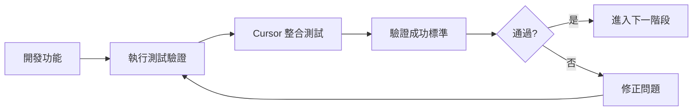

# 測試驗證文件索引

本目錄包含台灣假期 MCP 伺服器開發計劃中所有階段的測試驗證標準和程序。

## 驗證檔案結構

| 檔案 | 階段 | 內容 | 驗證重點 |
|------|------|------|----------|
| [stage-1-verification.md](./stage-1-verification.md) | 階段 1 | 專案基礎建設 + 早期 Cursor 整合 | 基礎框架、型別定義、早期 MCP 連接 |
| [stage-2-verification.md](./stage-2-verification.md) | 階段 2 | 資料服務層實作 + 中期 Cursor 驗證 | 假期資料服務、查詢方法、中期功能驗證 |
| [stage-3-verification.md](./stage-3-verification.md) | 階段 3 | MCP 工具實作 | 完整 MCP 工具、功能驗證 |
| [stage-4-verification.md](./stage-4-verification.md) | 階段 4 | MCP 協議整合 + 最終 Cursor 驗證 | 協議整合、資源實作、NPX 驗證 |
| [stage-5-verification.md](./stage-5-verification.md) | 階段 5 | NPX 套件設定 | 跨平台測試、套件配置 |
| [stage-6-verification.md](./stage-6-verification.md) | 階段 6 | 整合測試與文件 | 品質保證、文件完善 |

## 驗證標準編號系統

- **測試驗證**：每個 Task 的基本功能測試
- **Cursor 整合測試**：實際 Cursor 環境驗證（🎯 標記）
- **驗證成功標準**：階段性里程碑驗證（✅ 標記，T{階段}.{任務}.V{編號}）

## 使用方式

1. **開發階段**：參考對應階段的驗證檔案進行測試
2. **問題排查**：根據驗證標準定位問題
3. **品質保證**：確保所有驗證標準都通過
4. **進度追蹤**：使用編號系統追蹤完成狀態

## 驗證流程

## 注意事項

- 所有驗證都應該在實際環境中執行
- Cursor 整合測試是關鍵驗證點
- 驗證失敗時應詳細記錄問題和解決方案
- 保持驗證標準與主計劃的同步更新 